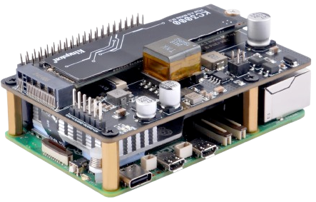

In reality I have no idea what I'm doing here, so I'll be figuring it out as I go along.

## High Level

It's a kubernetes cluster as a home server

| **Components**         | **Name**     | **Explanation**                                 |
|------------------------|--------------|-------------------------------------------------|
| **Project**            | Ilúvatar     | Creator and orchestrator of everything          |
| **Cluster**            | Eä           | The world of existence                          |
| **Nodes**              | Ainur        | The beings governing existence                  |
| **Primary Nodes**      | Valar        | The rulers and shapers of the world             |
| **Secondary Nodes**    | Maiar        | Lesser nodes serving the Valar                  |
| **Critical workloads** | Quendi       | The foundational apps                           |
| **Regular Workloads**  | Atani        | Non-critical, nice to have apps                 |
| **Other Workloads**    | Perian       | Apps that are just kinda doing their own thing  |

## Software

My primary concern with having multiple physical nodes is managing them, for example
 - Keeping them updated
 - Keeping them consistent with each other / preventing drift
 - Keeping data safe
 - Networking issues
 - Hardware failure

The list could go on forever really. I needed a way to theoretically (but never actually) have unlimited devices in a consistent and supported way.

### NixOS
I knew I wanted a reproducible, easy to configure and update system. I didn't want to find myself in a situation where I had to reconfigure my cluster and forgot any edge cases or didn't document something properly.

So originally I looked at running [Talos](https://talos.dev), which is an immutable (read-only) OS created for exactly that purpose, but I [found it doesn't yet support Pi 5](https://github.com/siderolabs/talos/discussions/7821).

This was a bit of a blessing in disguise, as truthfully I wanted to start experimenting with NixOS and was putting it off, but now I had no choice.

NixOS lets you define your entire system in a single configuration file, every aspect from which packages you have installed, your timezone, services, drivers and user accounts.

With NixOS I can create real reproducible OS images that

### Kubernetes (k3s)

I know I want to run Kubernetes first, in the past I have defaulted to ProxMox and at best ran rancher/portainer/etc in VMs - this time I wanted to go full in.

### ArgoCD

I have been using Argo products professionally for a few years now and really just couldn't imagine managing apps any other way now.

## Headlamp

Kubernetes dashboard

## Longhorn

Kubernetes distributed storage

## Hardware

Big ambitions usually come with big price tags, this ones no different

### Nodes
I want the machines running in the cluster to:
 - Be compact
 - Be rack mountable
 - Support SSD storage (NVMe)
 - Support Power over Ethernet (PoE)

This would allow me to add new nodes to the cluster by simply placing them in the rack and adding a patch cable.

Many different types of machine can fill this gap, but because I'm extremely boring and predictable I made a questionable choice and decided to use some Raspberry Pi 5's - which don't.

In order to get NVMe and PoE support, you have to then pick up a additional "HATs" (Hardware Attached on Top), add-on circuits that sit on on top of the Pi and connect to it's GPIO headers.

This alone is enough to make the Pi not an option for a lot people, for a lesser price point you can get alternative SBCs (Single Board Computers) with these features, or even traditional x86 Mini-PCs with these features and superior power.

But for now I've committed and the Pi 5 it is.

#### Node configuration
| Configuration               | Master | Netboot | Cluster Storage  | Cost                   |
|-----------------------------|--------|-------|------------------|------------------------|
| Pi + SD + NVMe + PoE        |  ✅   |  ❌   |  ✅              | £80+£5+£15+£22 = £122 |
| Pi + SD + NVMe              |  ✅   |  ❌   |  ✅              | £80+£5+£15 = £100     |
| Pi + SD + PoE               |  ✅   |  ❌   |  ❌              | £80+£5+£22 = £107     |
| Pi + SD                     |  ✅   |  ❌   |  ❌              | £80+£5 = £85          |
| Pi + NVMe + PoE             |  ❌   |  ✅   |  ✅              | £80+£15+£22 = £117    |
| Pi + NVMe                   |  ❌   |  ✅   |  ✅              | £80+£15 = £95         |
| Pi + PoE                    |  ❌   |  ✅   |  ❌              | £80+£22 = £102        |
| Pi                          |  ❌   |  ✅   |  ❌              | £80                   |

### Power Management

Switch/ UPS TODO

I use a Ubiquiti USW-Pro-24-POE in my rack, with this switch I can power the Pi's from the network and even restart them remotely. I have plans to integrate HomeAssistant at some point but we'll see.