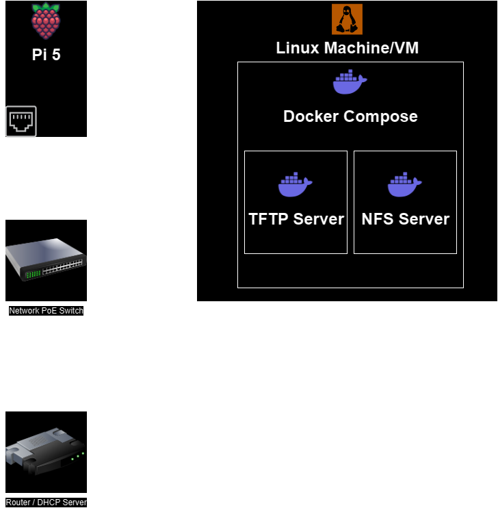

If at first you have nothing in your hands but a Raspberry Pi with no OS, you're in the right place.

The aim of this project is to automate as much as the process as possible - so to bootstrap the cluster I'll be using Netboot / PXE.

### Prerequisites
:::caution[Docker under non Linux Hosts]
If you are running on Windows or Mac, these hosts don't support 'host' mode networking.

To workaround I recommend firing up a bridged networking Linux VM, and running docker on that.
:::

 - Linux Machine / VM
   - Network connectivity
   - Docker
   - Copy of this repo
 - A Raspberry Pi
   - Network connectivity

## Explanation

    
What is PXE?

> PXE stands for "Preboot Execution Environment." It is a standard that allows a computer to boot and run an operating system over a network, without the need for a local storage device like a hard drive or a USB drive.
>
> PXE is commonly used in enterprise environments, data centers, and for large-scale deployment of operating systems. It enables network booting by providing a set of protocols and services that allow a computer to request and receive an operating system image from a server over the network.
>
>  -- ChatGPT 🤖

**Disclaimer**: It is not actually completely accurate to use the term to PXE when working with the Raspberry Pi. PXE is mostly common on x86-based systems, instead Pi's use a process called 'netboot' that involves the use of the Raspberry Pi bootloader and firmware.

I am only using the term PXE here as it is a more well known term and is often used to describe booting over the network in general.

It's worth noting that because of this, you are actually able to bypass common PXE (or even netboot) issues by configuring `boot/config.txt` ahead of time. However my goal is to bootstrap devices without any existing boot devices, so I'll be doing a more traditional network configuration based approach

### How Pi Netboot works

With netboot enabled, at boot the Pi will connect to the network and look for a TFTP server.

The TFTP server is found by asking the networks DHCP server for it's location. Alternatively it can be defined in `boot/config.txt` under `TFTP_IP`, but as mentioned previously this requires an existing boot device, which we don't have.

If the server connection succeeds, the Pi bootloader immediately looks for its boot filesystem contents, starting with `/config.txt`.

Initially the root of the server will be queried, but the Pi will also attempt to look under a subdirectory matching the its serial number, which can be utilized to manage device specific boot configurations.

From there the boot files instruct the Pi on what to do next. This will of course depend on what you have set up in `/cmdline.txt`, but the typical move here is to mount the desired OS filesystem from an NFS server and boot into that.

### Diagram
