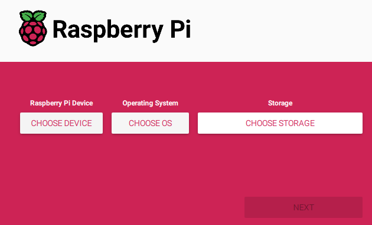
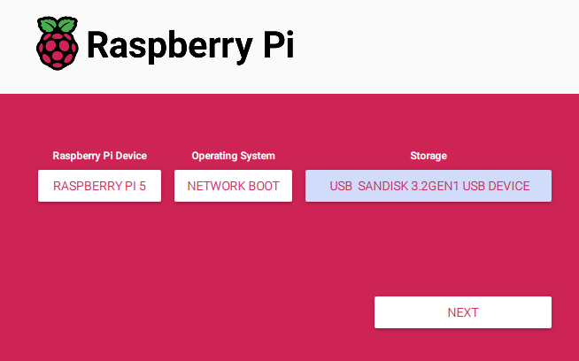
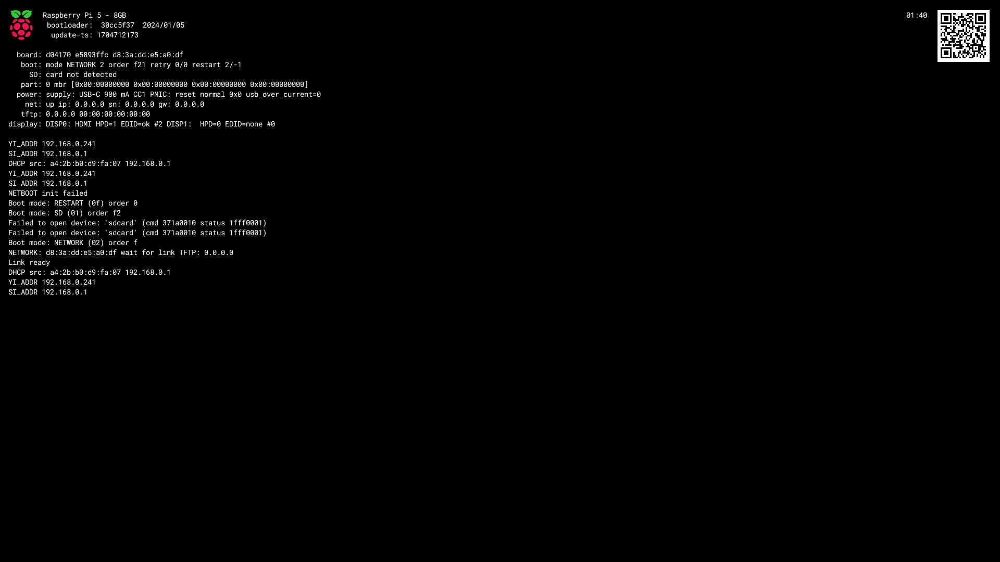

This guide covers explanation and implementation of any required preperation of the Pi itself.

## Explanation

Super annoyingly, the Pi won't do netboot by default. It will instead just boot loop and keep checking for USB and SD boot options.

To enable Network Boot you have to update the devices eeprom settings - the quickest way to do this is with the '[Raspberry Pi Imager](https://www.raspberrypi.com/software/)'

## Implementation
:::caution[Manual Action]
This is a per device manual action, cannot be automated :(
:::

### Prerequisites
 - A computer to run Pi Imager on (Win, Mac, Lin)
 - An SD Card or USB that your Pi can boot from
 - A Raspberry Pi

#### Create EEPROM update image
To begin, download and install '[Raspberry Pi Imager](https://www.raspberrypi.com/software/)'.

Once installed, launch the program and you are presented with a simple UI.

Use the first button to select your target device.

For the second button choose 'Misc utility images' and then 'Bootloader' and finally 'Network Boot'.

For the final button, choose the USB/SD device you wish to write the image to. All existing data on the device will be deleted so be careful what you do here.

When you are happy press the 'Next' button and wait.

:::tip[You might be doing this often]
It might be worth keeping this USB/SD ready to go for onboarding new Pi's, without having to reflash the image every time.
:::

#### Flash changes to the Pi

Put the newly created USB/SD into the Raspberry Pi and turn it on, wait for the Pi's Power LED to start blinking - this means the process is complete and the boot order should have changed.

You can confirm this by removing the USB/SD and rebooting the Pi and watching the boot output via HDMI.

The 'boot' option should now display NETWORK, and the 'net' option should now show the Pi's IP address, you will also see scrolling output of the Pi trying to locate a TFTP server.

Your Pi is now configured to boot from the network 🎉

Hopefully the Pi 6 has netboot enabled from the factory :)

## Next Steps

So now we have a Pi looking to boot from network, but no server ready to fulfill that request.