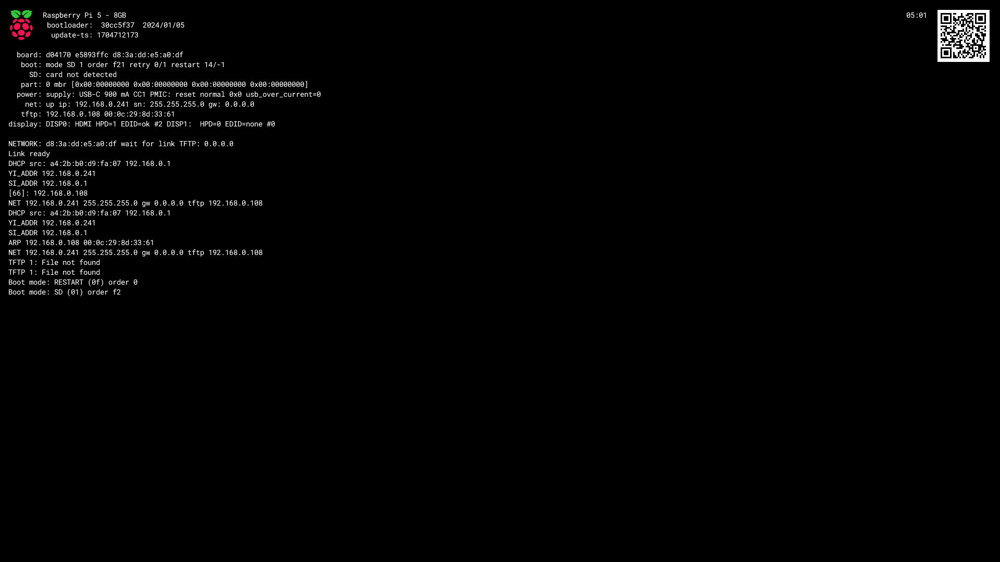

This guide covers explanation and implementation of the components required for a complete Pi Netboot capable server

## Explanation

In order to successfully Netboot a Pi, you need a server on your network capable of serving the necessary files over the correct protocols.

There are two protocols we will be using, TFTP and NFS. For simplicity we will be hosting these together on a single machine, and calling this our 'Netboot' server.

### Components
- **DHCP Server**
    - DHCP (Dynamic Host Configuration Protocol) is responsible for dynamically assigning IP addresses and network configuration information to devices on a network.
    - If you're reading this you likely already know what/where your DHCP server is. If you don't, and you're a home user, then it's 99% built into your router.
    - We will be modifying our DHCP server settings to tell devices on the network where to look for the TFTP server.
- **TFTP Server**
    - TFTP (Trivial File Transfer Protocol) is responsible for simple and lightweight file transfers between devices on a network, commonly used for tasks such as updating firmware or booting diskless devices.
    - It's highly unlikely you already have a TFTP server running, we will be creating a new one specifically for bootstrapping pi devices
    - The TFTP server will provide the Pi with it's boot partiton files
    - We'll be running this in a container image served via Docker 🐋
- **NFS Server**
   - NFS (Network File System) is responsible for enabling remote access and sharing of files between networked systems in a transparent and platform-independent manner.
   - Again, very unlikely you already have an NFS server. But we'll be standing up a new bootstrap specific one anyway
   - The NFS server will provide the Pi with it's OS partition files
   - Again, container image served via Docker 🐳
- **Netboot client**
   - The Raspberry Pi itself🥧

:::caution[NFS Version Support]
  [There is unfortunately a bug that prevents the Pi from booting over NFS4](https://bugs.launchpad.net/ubuntu/+source/linux-raspi/+bug/1954716), which means we need to the much more complex and insecure NFS3 😔
:::

## Implementation

### Creating a Netboot capable Server

Typically, a server (of any kind) would run on an always-on machine within your network. However since we are starting from zero here and assuming there currently is no server, we will be running our initial bootstrap server via Docker on our Linux machine.

First, note your Linux machines IP address, you will need to know it going forward.

Start the required servers with the supplied docker compose file:

```
cd ~
git clone https://github.com/andrewiankidd/pi-k3s-gitops.git
cd pi-k3s-gitops
sudo modprobe nfs
sudo modprobe nfsd
sudo systemctl stop rpcbind
sudo systemctl stop rpcbind.socket
sudo docker compose -f ./src/bootstrap/netboot/docker-compose.yml up
```

The TFTP and NFS servers will now be running 🎉

### DHCP Configuration
:::caution[Manual Action]
This is a one time manual action, cannot be automated :(
:::

Now the TFTP server is running, we need to make it known to your local network. In order to do this you must update your DHCP server configuration.

You can get really advanced with this - [so I will defer to the linuxserver.io documentation for more info](https://docs.linuxserver.io/images/docker-netbootxyz/#router-setup-examples) should you want to research more.

But in my testing, I found that all the Pi really cares about is [OPTION 66](https://wiki.ipitomy.com/wiki/Option_66), which defines your provision server, which in our case is our TFTP server.

So with that in mind, I did the following:

1. SSH'd to my router...
    ```
    ssh root@192.168.0.1
    ```
3. opened dnsmasq.conf...
    ```
    nano /etc/dnsmasq.conf
    ```
4. appended the following lines (where 192.168.0.108 is the IP of the machine running Docker):
    ```
    # define option 66 / tftp-server
    dhcp-option=66,192.168.0.108
    ```
5. restarted dnsmasq
    ```
    /etc/init.d/dnsmasq restart
    ```

You should be able to test this change with an `nmap` dhcp discovery request
```
root@ubuntuvm:~$ nmap --script broadcast-dhcp-discover
Starting Nmap 7.80 ( https://nmap.org ) at 2000-01-01 00:00 UTC
Pre-scan script results:
| broadcast-dhcp-discover:
|   Response 1 of 1:
|     IP Offered: 192.168.0.249
|     DHCP Message Type: DHCPOFFER
|     Server Identifier: 192.168.0.1
|     IP Address Lease Time: 2m00s
|     Renewal Time Value: 1m00s
|     Rebinding Time Value: 1m45s
|     Subnet Mask: 255.255.255.0
|     Broadcast Address: 192.168.0.255
|     Router: 192.168.0.1
|     Domain Name: kidd.local
|     Domain Name Server: 192.168.0.3, 192.168.0.1
|_    TFTP Server Name: 192.168.0.108\x00
WARNING: No targets were specified, so 0 hosts scanned.
Nmap done: 0 IP addresses (0 hosts up) scanned in 3.60 seconds
```

As you can see on the last line of the dhcp script output, the TFTP server is now defined and is the IP of the machine running Docker 🎉

If you power up your Pi again, you should see it query the TFTP server for files (`TFTP 1: file not found`)


## Next Steps

So now we have a Pi looking to boot from network, and a Server looking to fulfill that need.

Next we need to provide the Boot + OS files to the server!