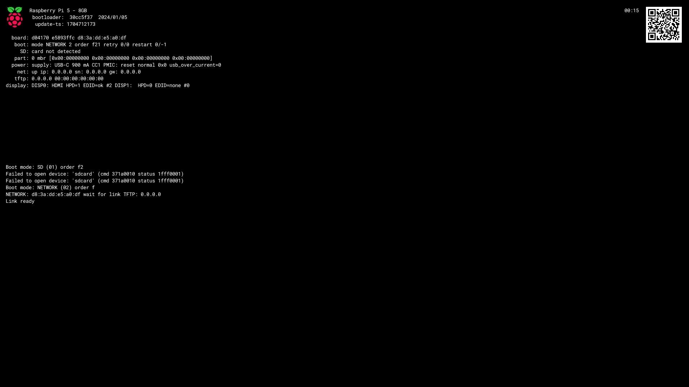
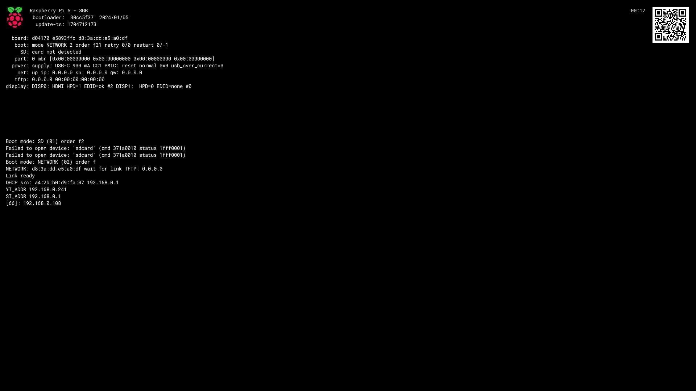
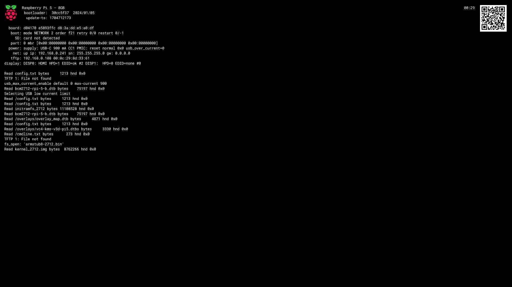
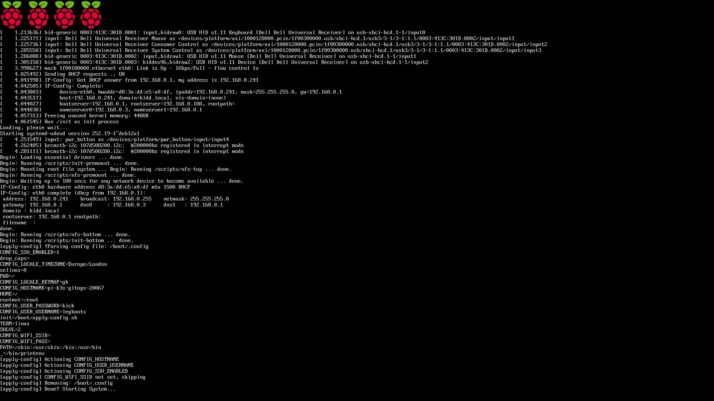
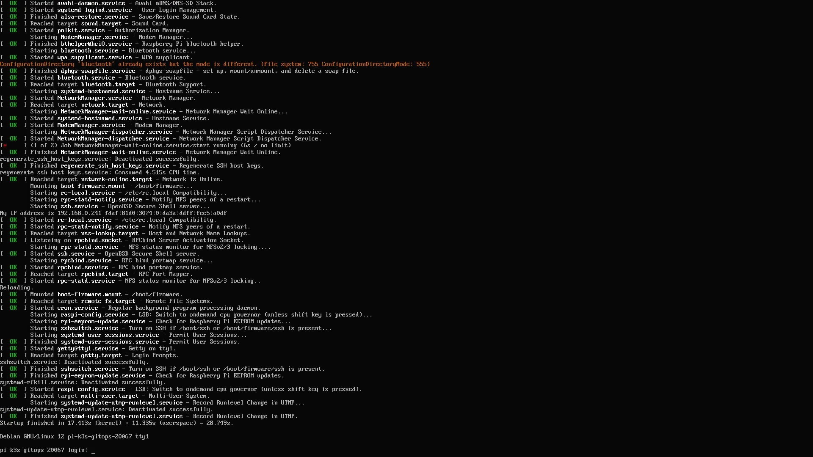

This part of the guide isn't essential. We are just going over the boot process end to end.

## Explanation

Lots of moving parts and lots of experimentation to get this working reliably and in a way I understand, let's review the boot process and end to end and then break it down.

### Components
- **NFS Server exposing OS files**
    - OS files are patched to load files from NFS share
    - OS files are patched to include a custom unattended configuration script
- **TFTP Server exposing boot files**
    - Boot files are patched to load OS from NFS share at boot
    - Boot files are also patched to execute custom unattended configuration script at boot
- **DHCP server configured with option 66 / tftp-server**
    - Your networks DHCP server is configured to announce your TFTP servers IP
- **Pi Configured with Netboot**
    - A Raspberry Pi 5 with netboot as an enabled option in the eeprom

## Implementation

With the Pi connected to the network, let's boot it.

Turn on the Pi!
<video controls width="100%" title="First Boot">
    <source src="../../../../assets/docs/guides/bootstrap/prep/first-boot.mp4" type="video/mp4">
    Your browser does not support the video tag.
</video>

### Review

Step by step breakdown of what happens in the video

##### Network Initialization
The Pi boots up and immediately initializes networking, a brief pause occurs as it contacts the network and obtains an IP address.

##### Netboot Initialization
Once network has initialized, the Pi will display some DHCP information

| Message   | Meaning |
| --------- | ----------------------------------------------------------------- |
| DHCP src  | IP address and MAC address of DHCP server                         |
| YI_ADDR   | IP address assigned to Pi by DHCP server                          |
| SI_ADDR   | IP address of DHCP server                                         |
| [66]      | IP of TFTP server, as defined by DHCP server option 66            |
| NET       | Summary of Network settings (Pi IP, Netmask, Gateway and TFTP IP) |
| ARP       | ARP data of the TFTP server (IP and MAC)                          |

##### Boot files loaded from TFTP server
The networking information at the top of the screen is now populated with this information going forward, and the Pi will now start requesting boot files from the TFTP server, starting with config.txt

##### System boots into bootloader
The system will now load the files previously retrieved from the TFTP server, including our customized `cmdline.txt` file which mounts the NFS server, and runs the `apply-config.sh` configuration script which in turn launches /sbin/init (systemd)

##### System boots into OS
And finally the OS init kicks in, and we are dropped at the login screen with our predefined hostname and credentials 🎉

## Next Steps

If you came here to learn more about booting a Raspberry Pi over the network, then I hope this helped.

That requirement is now fulfilled, however for my needs there is much more to do 🤠